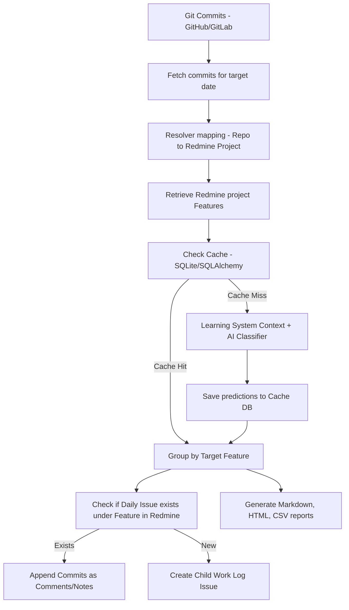

# CommitFlow: AI-Powered Redmine Worklog Automation

CommitFlow is a production-grade, extensible Python application designed to automate the daily logging of developer tasks into Redmine. By analyzing Git commit logs and file changes from GitHub and GitLab, and leveraging advanced Large Language Models (LLMs), CommitFlow maps your daily coding activities directly onto Redmine Features (Parent Issues) and files child work logs under them automatically.

---

## Architecture Overview



### Key Architectural Concepts

- **SOLID & Clean Architecture**: Logic layers are clearly decoupled. Integrations (GitHub, GitLab, Redmine) are abstracted behind separate clients.
- **AI Classification**: Leverages system-instructed prompt templates and string similarity checks (`rapidfuzz`) to assign work logs to actual Redmine issues, avoiding invented features.
- **AI Decision Cache**: Avoids duplicate calls to AI APIs by logging processed commit hashes in a local SQLite database cache.
- **Few-Shot Learning System**: If the AI makes a mistake, logging the correction via `commitflow add-feedback` appends it as few-shot training rules in subsequent prompts to automatically adjust recommendations.
- **Duplicate Prevention**: Searches Redmine issues prior to writing. If a work log issue already exists for the day under a Feature, new commits are cleanly appended as journal updates instead of creating duplicate items.

---

## Project Structure

```
app/
    ai/
        provider.py               # Abstract provider interface
        openai_provider.py        # OpenAI completions integration
        gemini_provider.py        # Google Gemini integration
        anthropic_provider.py     # Anthropic Claude integration
        ollama_provider.py        # Local Ollama integration
        openrouter_provider.py    # OpenRouter API integration
    config/
        settings.py               # Pydantic environment configurations
    database/
        connection.py             # SQLAlchemy session and engine initialization
        models.py                 # SQLite Declarative Base tables
        repository.py             # Database read/write functions
    github/
        client.py                 # GitHub REST API client
    gitlab/
        client.py                 # GitLab REST API client
    mappings/
        resolver.py               # YAML repo-to-project resolver mapping loader
    models/
        domain.py                 # Unified domains schemas
    redmine/
        client.py                 # Redmine API Client
    services/
        classifier.py             # Prompt builder, AI runner & similarity resolver
        reporting.py              # Markdown, HTML, CSV summary exporter
        sync.py                   # Main synchronization workflow orchestrator
    utils/
        helpers.py                # Retry decorators and utility logic
    cli.py                        # Typer CLI application wrapper
configs/
    repo_mappings.yaml            # Repo to Redmine project mapping configuration
tests/                            # Full Pytest test suites
README.md                         # Product manual
pyproject.toml                    # Packages configuration and CLI setup
requirements.txt                  # Direct package requirements
```

---

## Installation

### Prerequisites
- Python 3.12 or higher installed.

### Setup Steps
1. Clone the project and navigate to the project directory:
   ```bash
   cd CommitFlow
   ```
2. Install the package in editable mode alongside required packages:
   ```bash
   pip install -e .
   ```
   *Note: This command will install dependencies and register the executable command `commitflow` globally within your active environment.*

---

## Configuration

1. **Environment Settings**: Copy `.env.example` to `.env` and fill out your tokens, API keys, and timezone settings:
   ```bash
   cp .env.example .env
   ```
   **Key Configuration Settings:**
   - `AUTHOR_NAME`: Your exact git committer name (used to filter commits).
   - `TIMEZONE`: Local timezone (e.g. `Asia/Kolkata`, `America/New_York`) to isolate date queries.
   - `AI_PROVIDER`: Choose from `openai`, `gemini`, `anthropic`, `openrouter`, or `ollama`.
   - `AI_CONFIDENCE_THRESHOLD`: Fallback threshold (default: 80). Confidence ratings below this map commits to the `DEFAULT_FEATURE`.

2. **Mappings**: Edit `configs/repo_mappings.yaml` to specify which Git repositories correspond to which Redmine projects:
   ```yaml
   repositories:
     digiflux-ezytix/be-api:
       redmine_project: Ezytix Tech
     digiflux-ezytix/web-app:
       redmine_project: Ezytix Tech
     digiflux-erp/backend:
       redmine_project: ERP
   ```

---

## CLI Usage

Verify installation by running:
```bash
commitflow --help
```

### 1. Test Connections
Test API keys, endpoints, and credentials for Redmine, GitLab, and GitHub:
```bash
commitflow test-connection
```

### 2. View Redmine Projects
Lists all Redmine projects with their identifiers:
```bash
commitflow list-projects
```

### 3. List Project Features
Lists all available Parent Features (parent tasks) for a project:
```bash
commitflow list-features "Ezytix Tech"
```

### 4. Sync Git Commits
Pull today's commits, run classification, and log features to Redmine:
```bash
# Sync today's work logs
commitflow sync --today

# Sync work logs for a specific past date
commitflow sync --date 2026-07-01
```

### 5. Add AI Correction Feedback
If the AI maps a commit to the wrong Feature, teach the system the correction:
```bash
commitflow add-feedback \
  --commit "a1b2c3d4" \
  --repo "digiflux-ezytix/be-api" \
  --msg "Added payments integration" \
  --predicted "General Development" \
  --corrected "Payment"
```
*Subsequent synchronizations containing similar commits will use this correction as context to increase classification accuracy.*

### 6. Manage Cache
```bash
# Inspect prediction cache
commitflow show-cache

# Purge cache
commitflow clear-cache
```

### 7. Export Summaries
Output Markdown, HTML, and CSV logs locally:
```bash
commitflow export-report 2026-07-06
```
Reports are output to the `./reports` directory.

---

## Running Tests

Tests are handled using `pytest` and mock configurations to avoid hitting external APIs.
To run the full suite:
```bash
pytest tests/
```
