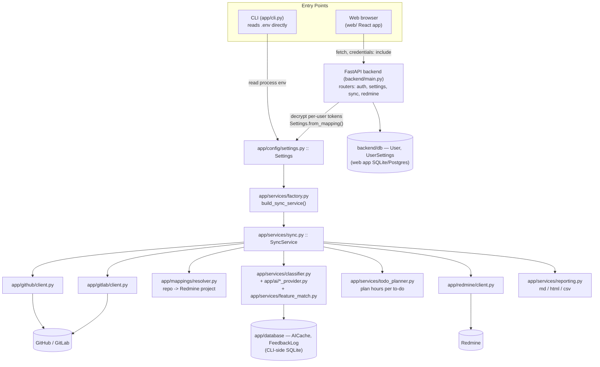

# CommitFlow — Architecture Guide

This is the "how it's wired together" document. For day-to-day commands (CLI usage,
deploy steps, env var setup) see [`../README.md`](../README.md) — this file focuses on
structure and data flow so a new contributor can find their way around quickly.

## 1. What CommitFlow is

CommitFlow automates daily Redmine worklogging. It reads a developer's Git commits for
a given day (from GitHub and/or GitLab), uses an AI model to classify each commit
against the right Redmine project **Feature** (a parent issue), plans a set of **To-Do**
child issues with hours distributed across a daily goal, and writes those To-Dos plus
time entries into Redmine — without creating duplicates on re-runs.

It ships as two front doors over one shared engine: a single-user **CLI** (`app/cli.py`)
for the original owner's own `.env`-based setup, and a multi-user **web app**
(`backend/` API + `web/` React frontend) that lets other people sign up and run the same
sync workflow with their own tokens.

## 2. High-level architecture



## 3. Repository map

```
app/                         # Core engine — used by BOTH the CLI and the web backend
    cli.py                   # Typer CLI: test-connection, sync, list-projects, list-features,
                              #   add-feedback, show-cache, clear-cache, export-report
    config/
        settings.py          # Pydantic Settings — env vars + Settings.from_mapping() for
                              #   building settings from a dict (used by the web backend)
    services/
        factory.py           # build_sync_service(settings) — wires clients + AI provider +
                              #   classifier into one SyncService (shared by CLI and web)
        sync.py               # SyncService — the sync_date() orchestrator (see §4)
        classifier.py         # Builds AI prompts, calls the provider, parses results
        feature_match.py      # rapidfuzz-based matching: AI label -> real Redmine Feature
        todo_planner.py       # Turns classified commits into WorkTodos with hours allocated
        reporting.py          # Exports Markdown/HTML/CSV summaries to ./reports
    ai/
        provider.py           # Abstract AIProvider (one method: classify(prompt) -> str)
        openai_provider.py, gemini_provider.py, anthropic_provider.py,
        openrouter_provider.py, ollama_provider.py, groq_provider.py
    github/client.py          # GitHub REST client (repo discovery, commit fetch)
    gitlab/client.py          # GitLab REST client (repo discovery, commit fetch)
    redmine/client.py         # Redmine REST client (projects, features, issues, time entries)
    mappings/resolver.py      # Loads configs/repo_mappings.yaml; repo -> Redmine project
    database/
        models.py             # SQLite tables: AICache, FeedbackLog (CLI-side, single-user)
        connection.py, repository.py
    models/domain.py          # Shared Pydantic domain types (see §6)
    utils/helpers.py          # Retry decorators, misc helpers

backend/                      # FastAPI multi-user web API (additive — CLI still works alone)
    main.py                   # FastAPI app, CORS, router registration, /api/health
    config.py                 # API-level settings (DB URL, CORS origins, cookie/JWT secrets)
    db/
        models.py             # User, EmailOtp, UserSettings (encrypted per-user credentials)
        session.py            # Engine/session setup, init_api_db()
    routers/
        auth.py                # Register/login, OTP email verification, password reset,
                                #   GitHub OAuth, account (display name/password/email) mgmt
        settings.py             # GET/PUT per-user UserSettings (Integrations page)
        sync.py                 # POST /api/sync (dry-run or live), POST /api/sync/commit
        redmine.py               # Read-only GET /api/redmine/day (today's logged time)
    auth/                      # Cookie helpers, JWT create/decode, get_current_user dependency
    services/
        user_settings.py        # Builds a Settings mapping from an encrypted UserSettings row
        email.py, email_templates.py, otp.py

web/                           # React + Vite frontend (see §8)
    src/App.jsx, api.js, auth.jsx, pages/*, components/*

configs/repo_mappings.yaml     # Repo -> Redmine project overrides (YAML)
tools/gmail_mail_bridge/       # Standalone FastAPI microservice: relays Gmail SMTP from a
                                #   host that isn't SMTP-blocked (see §9)
tests/                         # Pytest suite (mocks external APIs)
main.py, api/index.py, vercel_handler.py   # ASGI entrypoints for different hosts (see §9)
```

## 4. Core sync pipeline (`SyncService.sync_date`)

Both the CLI (`sync --today` / `sync --date`) and the web API (`POST /api/sync`) call
the exact same method, `app/services/sync.py::SyncService.sync_date()`:

1. **Discover repos** — from GitHub/GitLab APIs, plus any repos only declared in
   `configs/repo_mappings.yaml`.
2. **Resolve project** — `MappingResolver` maps each repo to a Redmine project name.
3. **Fetch commits** — for the target date, filtered to the configured author, from the
   correct provider (GitHub or GitLab) per repo.
4. **Classify** — for each commit, check the `AICache` SQLite table first (avoids
   repeat AI calls); cache misses are batched per-repo and sent to the configured AI
   provider (`classifier.py`) along with any `FeedbackLog` corrections as few-shot
   examples. `feature_match.py` then reconciles the AI's feature label with a real
   Redmine Feature issue (exact match → fuzzy name match → content-based relatedness →
   default feature → any existing Feature) — it deliberately never invents a
   Support/Meeting issue as a parent.
5. **Plan to-dos** — `TodoPlannerService.plan()` scores each commit's effort (lines/files
   changed, conventional-commit type) and distributes the `daily_hour_goal` across
   To-Dos proportionally to that score, padding with synthetic follow-up To-Dos if there
   are fewer commits than `min_todos`. If the result exceeds the optional `max_todos`
   cap, `merge_related_todos()` collapses extra To-Dos into existing ones that already
   share the same project + Feature parent (summing hours, concatenating descriptions) —
   it never merges across different features, since that would misattribute logged time
   to the wrong Redmine parent; if more distinct features were touched than `max_todos`
   allows, one To-Do per feature is kept as the floor and a warning is logged.
6. **Write to Redmine** (skipped when `dry_run=True`) — for each planned To-Do:
   reuse an existing issue with the same subject under the same Feature if one exists
   (idempotent re-sync), otherwise create it; verify/re-parent it under a real Feature
   (never Support/Meeting); then log the remaining hours as a time entry, topping up
   rather than duplicating if some hours were already logged for that day.
7. **Export reports** — Markdown/HTML/CSV summaries written to `./reports/`.

The web API's `POST /api/sync/commit` route lets the frontend apply an already-computed
dry-run plan (`SyncService.apply_planned_todos`) without re-fetching or re-classifying —
used after a user reviews a preview in the UI.

If any planned To-Do has no matched Feature parent and the caller hasn't set
`allow_missing_parent`, `sync_date` raises `MissingParentError`, which the API surfaces
as an HTTP 409 so the frontend can ask the user to confirm before creating a new Feature.

## 5. CLI side vs. web side

| | CLI | Web app |
|---|---|---|
| Entry point | `app/cli.py` (Typer) | `backend/main.py` (FastAPI) |
| Settings source | `.env` file, read directly by `Settings` | Per-user `UserSettings` DB row, decrypted and passed through `Settings.from_mapping()` (`backend/services/user_settings.py`) |
| Users | Single (the machine owner) | Many, each with their own tokens/settings |
| Secrets | Plaintext in local `.env` | Fernet-encrypted `_enc` columns in `backend/db/models.py::UserSettings` |
| Shared core | `build_sync_service()` → `SyncService` | Same `build_sync_service()` → `SyncService` |

Both paths converge on `app/services/factory.py::build_sync_service(settings)`, which
initializes the CLI-side cache DB, constructs `GitHubClient`/`GitLabClient`/`RedmineClient`/
`MappingResolver`, picks an AI provider from `settings.ai_provider`, and returns a fully
wired `SyncService`. This is the one place that assembles the engine — reuse it rather
than constructing `SyncService` by hand.

## 6. Data model reference

**Two separate SQLite schemas — don't confuse them:**

- `app/database/models.py` (CLI-side, single-user, purely a performance/learning cache):
  - `AICache` — `commit_hash` + `repository` → predicted feature/confidence/reason/provider,
    so a commit is never re-classified twice.
  - `FeedbackLog` — predicted vs. corrected feature (from `commitflow add-feedback`), fed
    back into future AI prompts as few-shot corrections.

- `backend/db/models.py` (web app, multi-user identity + settings):
  - `User` — email/password hash, GitHub OAuth id, email-verified flag.
  - `EmailOtp` — hashed one-time codes for signup/reset/email-change flows.
  - `UserSettings` — one-to-one with `User`; non-secret prefs (`ai_provider` defaults to
    `groq`, `daily_hour_goal`, etc.) plus Fernet-encrypted secret columns
    (`github_token_enc`, `gitlab_token_enc`, `redmine_api_key_enc`, and one `_enc` key per
    AI provider).

**Domain types** (`app/models/domain.py`, Pydantic, shared by both sides):

| Type | Purpose |
|---|---|
| `Commit` | One Git commit: hash, message, stats, changed files, provider |
| `DiscoveredRepo` | A repo found via GitHub/GitLab discovery |
| `RedmineFeature` | A Redmine parent issue acting as a "Feature" |
| `ClassifiedCommit` | A commit paired with its resolved project + feature |
| `WorkTodo` | A planned daily To-Do with allocated hours/feature/commits |
| `SyncResult` | Outcome of a sync run: created/updated issue IDs, hours logged, errors, `dry_run` |

## 7. AI provider layer

`app/ai/provider.py` defines a minimal abstract interface — one method,
`classify(prompt: str) -> str`, returning the raw text (expected JSON) from the model.
Six providers implement it: **openai, gemini, anthropic, openrouter, ollama, groq**.
`AI_PROVIDER` in settings selects which one `factory.py` instantiates; `groq` is the
default in the web app's `UserSettings` model. (Note: the top-level `README.md`'s
provider list predates `groq` being added — this doc is the up-to-date reference.)

## 8. Frontend map (`web/`)

React + Vite + `react-router-dom`. `web/src/api.js` talks to the backend via `fetch`
with `credentials: "include"` — auth is an httpOnly cookie set by the backend, there is
no bearer token held in JS.

| Route | Page | Notes |
|---|---|---|
| `/login` | `LoginPage` | Public |
| `/verify-email` | `VerifyEmailPage` | Public, OTP entry after signup |
| `/forgot-password` | `ForgotPasswordPage` | Public |
| `/auth/callback` | `AuthCallback` | Public, lands here after GitHub OAuth redirect |
| `/` | `SyncPage` ("Sync desk") | Private — run dry-run/live sync, review planned To-Dos |
| `/todos` | `TodosPage` ("Day log") | Private — view today's Redmine time entries |
| `/integrations` (`/settings` redirects here) | `SettingsPage` | Private — save tokens/AI provider/mappings |
| `/account` | `AccountPage` | Private — display name, password, email changes |

Private routes are wrapped in a `Shell` layout (left nav rail + workspace area) and
redirect to `/login` if the user isn't authenticated.

## 9. Deployment surfaces

| Surface | What it's for |
|---|---|
| Local (`.venv` + `uvicorn backend.main:app` + `npm run dev`) | Day-to-day development |
| Docker Compose (`docker-compose.yml`) | `api` (from `Dockerfile.api`) + `web` services for a self-contained local/staging run |
| Railway (`railway.toml` → `Dockerfile.api`) | Hosts the API when outbound Gmail SMTP is needed — Render blocks it, Railway doesn't |
| Vercel (`api/index.py`, Mangum wrapper) | Experimental serverless hosting; frontend and backend are separate Vercel projects |
| `tools/gmail_mail_bridge/` | Standalone FastAPI microservice that relays Gmail SMTP sends from a host that isn't SMTP-blocked, for when the main API *is* hosted somewhere that blocks it |

See `README.md` for the exact step-by-step deploy instructions for each surface.

## 10. Where to go next

- **Day-to-day CLI commands and setup**: [`README.md`](../README.md)
- **Tests**: `tests/` (pytest, mocks all external APIs — `pytest tests/`)
- **Repo-to-Redmine-project mapping config**: `configs/repo_mappings.yaml`
